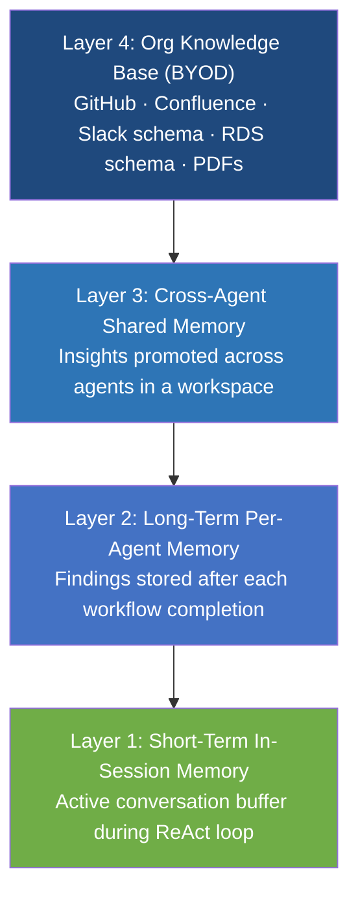
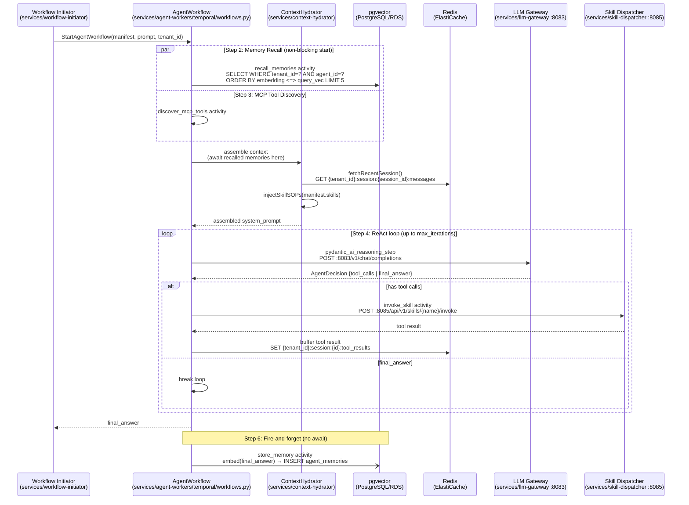
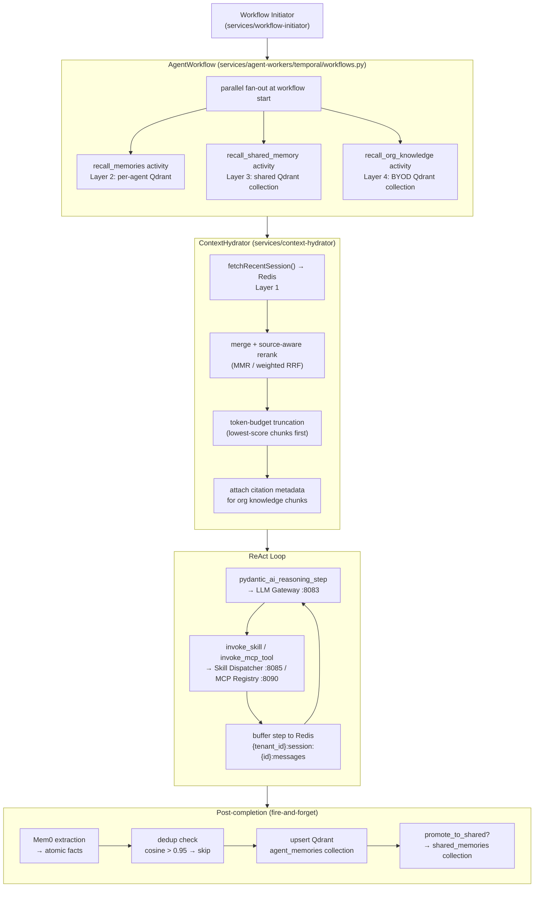
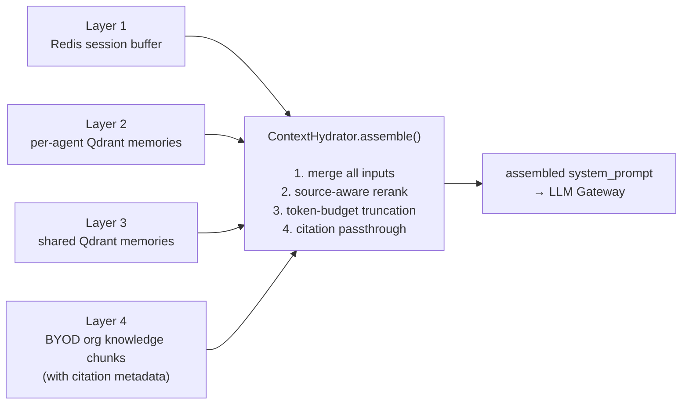
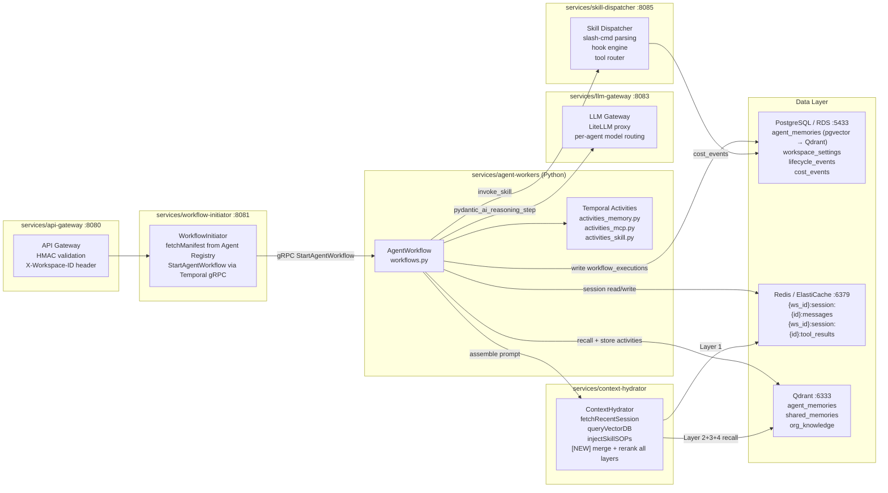
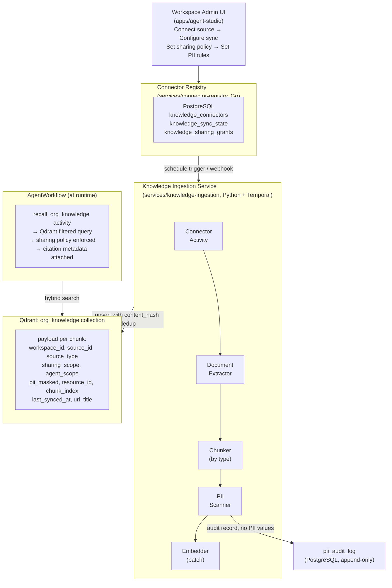
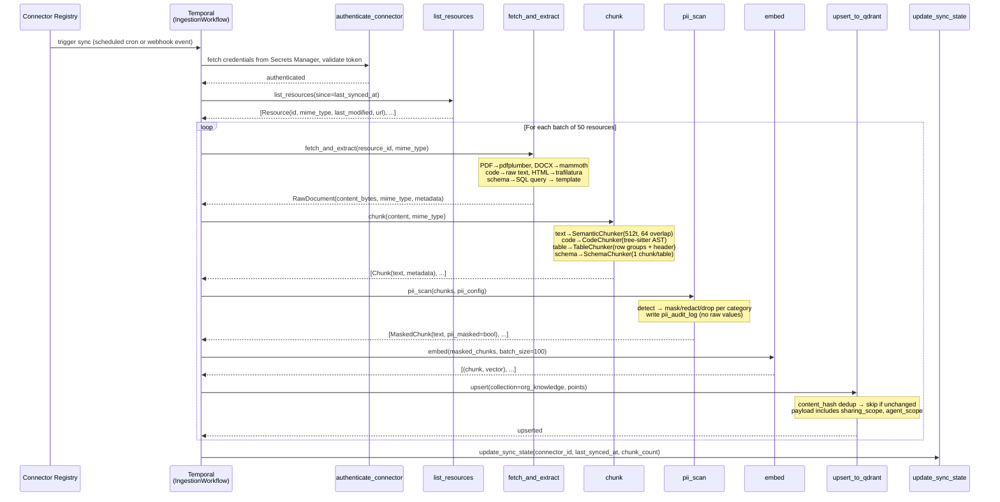
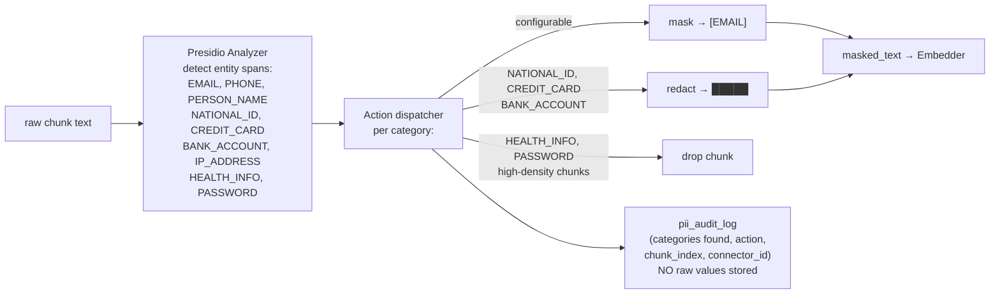
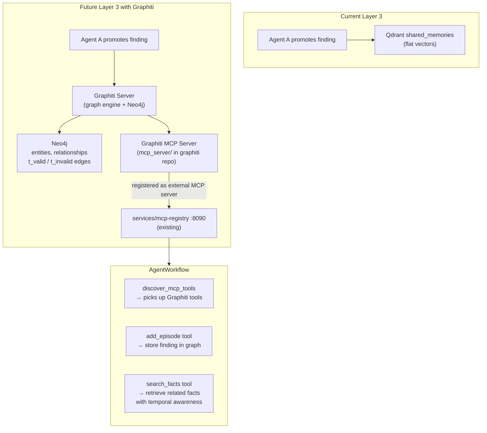

# Memory, RAG & BYOD Knowledge Architecture

**Repository:** `rayarun/a1-agent-engine`
**Covers:** `services/agent-workers/`, `services/context-hydrator/`, `infra/local/`, `packages/go-shared/`

---

## Table of Contents

1. [Memory Model Overview](#1-memory-model-overview)
2. [Current Implementation](#2-current-implementation)
3. [Limitations of the Current Setup](#3-limitations)
4. [Production Memory Architecture](#4-production-memory-architecture)
5. [How the Codebase Interacts with the Memory Layer](#5-codebase-interaction)
6. [Open Source Tool Recommendations](#6-open-source-tools)
7. [Migration Path](#7-migration-path)
8. [BYOD Knowledge Layer](#8-byod-knowledge-layer)
9. [Future Improvements: Graphiti Temporal Knowledge Graph](#9-future-improvements)
10. [Environment Variables](#10-environment-variables)

---

## 1. Memory Model Overview

Four distinct memory scopes matter for the A1 Agent Engine platform:

| Scope | What it stores | Lifespan | Who accesses it |
|---|---|---|---|
| **Short-term (in-session)** | Current conversation turns, tool call results, reasoning steps | Duration of one workflow execution | Single agent instance |
| **Long-term per-agent** | Findings, conclusions, learned preferences from past executions | Weeks to months | The same agent across sessions |
| **Cross-agent shared** | Insights promoted by one agent that other agents benefit from | Persistent | Any agent within a workspace |
| **Org knowledge base** | Indexed content from connected data sources (BYOD) | Persistent, refreshed on sync schedule | All agents in a workspace |



---

## 2. Current Implementation

### 2.1 Where the code lives

```
services/agent-workers/
  temporal/
    workflows.py              ← AgentWorkflow: orchestrates recall + store
    activities/
      activities_memory.py   ← recall_memories, store_memory activities
      activities_mcp.py      ← MCP tool discovery
      activities_skill.py    ← skill invocation

services/context-hydrator/   ← ContextHydrator: assembles system prompt
  hydrator.go (or .py)
    fetchRecentSession()     ← reads Redis session buffer
    queryVectorDB()          ← queries pgvector long-term memories
    injectSkillSOPs()        ← injects skill standard operating procedures
```

### 2.2 AgentWorkflow execution steps (from `workflows.py`)



### 2.3 recall_memories activity (from `activities_memory.py`)

```python
# services/agent-workers/temporal/activities/activities_memory.py

@activity.defn
async def recall_memories(agent_id: str, tenant_id: str, prompt: str) -> list[str]:
    embedding = await embed(prompt)           # via LLM Gateway embedding endpoint
    results = await pgvector_query(
        table="agent_memories",
        embedding=embedding,
        filter={"tenant_id": tenant_id, "agent_id": agent_id},
        top_k=5,
        index="ivfflat"                       # cosine similarity
    )
    return [r.text for r in results]
```

Started as a non-blocking parallel activity at workflow start. The result is awaited just before the first LLM call inside `ContextHydrator.assemble()` — so embedding and retrieval happen concurrently with MCP tool discovery.

### 2.4 store_memory activity

```python
@activity.defn
async def store_memory(agent_id: str, tenant_id: str, final_answer: str) -> None:
    embedding = await embed(final_answer)
    await pgvector_insert(
        table="agent_memories",
        text=final_answer,
        embedding=embedding,
        metadata={"agent_id": agent_id, "tenant_id": tenant_id}
    )
```

Fire-and-forget — the workflow does not await this. Memory writes add zero latency to the response.

### 2.5 Current pgvector schema

```sql
-- PostgreSQL (Amazon RDS) with pgvector extension
CREATE TABLE agent_memories (
    id          UUID PRIMARY KEY DEFAULT gen_random_uuid(),
    tenant_id   TEXT NOT NULL,
    agent_id    TEXT NOT NULL,
    text        TEXT NOT NULL,
    embedding   VECTOR(1536),           -- OpenAI text-embedding-3-small
    created_at  TIMESTAMPTZ DEFAULT NOW()
);

-- RLS policy consistent with platform-wide pattern
CREATE POLICY tenant_isolation ON agent_memories
    USING (tenant_id = current_setting('app.tenant_id'));

-- IVFFlat ANN index (current)
CREATE INDEX ON agent_memories
    USING ivfflat (embedding vector_cosine_ops)
    WITH (lists = 100);
```

### 2.6 Short-term memory: Redis key pattern

```
{tenant_id}:session:{session_id}:messages        ← conversation turns
{tenant_id}:session:{session_id}:tool_results    ← tool call outputs
{tenant_id}:session:{session_id}:context         ← assembled context window
```

Managed by `ContextHydrator.fetchRecentSession()`. No TTL is enforced in the current local setup. ElastiCache is the production target.

### 2.7 ContextHydrator (from `services/context-hydrator/`)

The Context Hydrator is the assembly point between recall activities and the LLM. It currently handles three sources:

```go
// services/context-hydrator/hydrator.go (conceptual)
type ContextHydrator struct {}

func (h *ContextHydrator) Assemble(
    sessionID, tenantID, agentID string,
    memories []string,
    manifest AgentManifest,
) string {
    session   := h.fetchRecentSession(tenantID, sessionID)   // Redis
    sopBlock  := h.injectSkillSOPs(manifest.Skills)          // Skill Catalog
    memBlock  := formatMemories(memories)                     // pgvector results

    return memBlock + sopBlock + session + manifest.SystemPrompt
}
```

In the production architecture this is extended to aggregate results from all four memory layers before injection.

---

## 3. Limitations of the Current Setup

### 3.1 pgvector under load

- **IVFFlat requires periodic full index rebuilds** as the dataset grows. HNSW avoids this but is more RAM-intensive.
- **No native pre-filter ANN search.** Filtering on `tenant_id` before the vector search requires workarounds (partial indexes, partitioned tables). Without them, pgvector performs ANN across all rows then applies the filter post-hoc, degrading recall quality at scale.
- **Shares OLTP resources.** Vector scans compete with workflow state writes, RLS-protected manifest lookups, and `cost_events` hypertable inserts on the same RDS instance.

### 3.2 No cross-agent sharing

Memories are scoped to `(tenant_id, agent_id)`. If the DB Triage agent finds that a slow query is caused by a missing index, the K8s Inspector working on the same incident gets no benefit from that finding.

### 3.3 No org-level knowledge base

Agents can only recall things they themselves have previously concluded. There is no mechanism to ingest runbooks, SOPs, or connected data sources.

### 3.4 No memory lifecycle management

No TTL, no decay for stale episodic memories, no deduplication of near-identical entries, no summarisation to consolidate many related facts, no distinction between episodic and semantic memory types.

### 3.5 Short-term memory durability gap

If a Temporal workflow is interrupted mid-execution (crash, HITL pause), the Redis session buffer is not durably flushed. On resume, Temporal replays from its event history, but any context assembled inside the hydrator between activity boundaries may not be fully reconstructed.

---

## 4. Production Memory Architecture

### 4.1 Full four-layer data flow



### 4.2 Layer 1: Short-term memory (improved)

Keep Redis as the hot buffer. Add checkpoint sync at each Temporal activity boundary so the assembled context window is always reconstructable from Temporal event history alone.

```
Redis (hot cache, <5ms reads, 24h TTL)
  ↕ checkpointed at each activity boundary
Temporal Event History (durable, crash-safe)
```

### 4.3 Layer 2: Long-term per-agent memory (Qdrant + Mem0)

Replace raw pgvector calls in `activities_memory.py` with the Mem0 SDK backed by Qdrant. Mem0 adds:

1. **LLM extraction** — distills verbose `final_answer` into atomic facts before storing
2. **Deduplication** — cosine similarity check before insert; skips if a near-identical memory exists (threshold 0.95)
3. **Type tagging** — `episodic` (what happened) vs `semantic` (general fact about system)
4. **Decay scoring** — episodic entries decay after 90 days; semantic entries after 365 days

```python
# activities_memory.py (production)
from mem0 import Memory

mem = Memory.from_config({
    "vector_store": {"provider": "qdrant", "config": {"host": "qdrant", "port": 6333}},
    "llm": {"provider": "anthropic", "config": {"model": "claude-haiku-4-5-20251001"}}
})

@activity.defn
async def store_memory(agent_id: str, tenant_id: str, final_answer: str,
                       promote_to_shared: bool = False) -> None:
    mem.add(
        messages=[{"role": "assistant", "content": final_answer}],
        user_id=agent_id,
        metadata={"tenant_id": tenant_id, "type": "episodic"}
    )
    if promote_to_shared:
        await qdrant.upsert(collection_name="shared_memories", ...)

@activity.defn
async def recall_memories(agent_id: str, tenant_id: str, prompt: str) -> list[str]:
    results = mem.search(query=prompt, user_id=agent_id,
                         filters={"tenant_id": tenant_id})
    return [r["memory"] for r in results]
```

**Retrieval improvement:** hybrid search (dense embedding + sparse BM25) rather than pure cosine similarity. Critical for queries containing specific entity names (hostnames, error codes, service names) where keyword matching outperforms semantic search.

### 4.4 Layer 3: Cross-agent shared memory

New `shared_memories` Qdrant collection scoped to `workspace_id` (not `agent_id`). An agent promotes a finding to the shared space explicitly.

```python
@activity.defn
async def recall_shared_memory(workspace_id: str, prompt: str) -> list[str]:
    embedding = await embed(prompt)
    results = await qdrant.search(
        collection_name="shared_memories",
        query_vector=embedding,
        query_filter=Filter(must=[
            FieldCondition(key="workspace_id", match=MatchValue(value=workspace_id))
        ]),
        limit=5
    )
    return [r.payload["text"] for r in results]
```

**Promotion:** agents can call `promote_finding_to_shared_knowledge` as an LLM-callable tool, or promotion can be rule-based (e.g., any finding referencing an infrastructure component or error pattern is auto-promoted).

### 4.5 Layer 4: Org knowledge base (BYOD — see Section 8)

Covered in full in Section 8. Agents query it via a new `recall_org_knowledge` activity, which runs in parallel with Layers 2 and 3 at workflow start.

### 4.6 Extended ContextHydrator



Source-aware re-ranking applies a weight matrix by `source_type × agent_domain`:

```python
SOURCE_WEIGHT = {
    "agent_memory":   {"code": 1.2, "ops": 1.3, "policy": 0.8},
    "shared_memory":  {"code": 1.0, "ops": 1.2, "policy": 0.9},
    "github":         {"code": 1.5, "ops": 0.9, "policy": 0.5},
    "confluence":     {"code": 0.6, "ops": 1.2, "policy": 1.5},
    "rds_schema":     {"code": 1.0, "ops": 0.8, "policy": 0.6},
}
```

`agent_domain` is inferred from `AgentManifest.domain` which already exists in `packages/go-shared/pkg/models/models.go`.

---

## 5. Codebase Interaction

### 5.1 Data flow across service boundaries



### 5.2 AgentManifest extension (packages/go-shared)

```go
// packages/go-shared/pkg/models/models.go

type AgentManifest struct {
    // ... existing fields ...
    MCPServers  []string `json:"mcp_servers,omitempty"`

    // New fields for memory and knowledge layer
    KnowledgeSourceFilter []string `json:"knowledge_source_filter,omitempty"`
    // e.g. ["github", "confluence", "rds_schema"]
    // nil = query all sources the workspace has connected

    KnowledgeTopK         int      `json:"knowledge_top_k,omitempty"`
    // default 8 if unset

    ContextTokenBudget    int      `json:"context_token_budget,omitempty"`
    // max tokens for injected context; ContextHydrator truncates to fit

    PromoteToShared       bool     `json:"promote_to_shared,omitempty"`
    // if true, findings are auto-promoted to shared_memories after each run

    Domain                string   `json:"domain,omitempty"`
    // "code" | "ops" | "policy" | "data"
    // used by ContextHydrator for source-aware reranking
}
```

### 5.3 New Temporal activities to add

```python
# services/agent-workers/temporal/activities/activities_knowledge.py  (new file)

@activity.defn
async def recall_org_knowledge(
    workspace_id: str,
    caller_agent_id: str,
    caller_agent_tags: list[str],
    query: str,
    source_filter: list[str] | None = None,
    top_k: int = 8
) -> list[KnowledgeChunk]:
    """
    Queries the BYOD org knowledge index.
    Enforces sharing policy at query time via Qdrant payload filters.
    Caches active sharing grants in Redis (60s TTL).
    """
    ...

@activity.defn
async def recall_shared_memory(workspace_id: str, query: str) -> list[str]:
    """Queries the cross-agent shared_memories Qdrant collection."""
    ...

@activity.defn
async def store_memory_with_promotion(
    agent_id: str,
    workspace_id: str,
    final_answer: str,
    promote_to_shared: bool = False
) -> None:
    """
    Replaces store_memory. Adds Mem0-backed extraction, dedup,
    and optional promotion to shared_memories.
    """
    ...
```

### 5.4 Updated workflows.py parallel recall block

```python
# services/agent-workers/temporal/workflows.py (updated)

@workflow.defn
class AgentWorkflow:
    @workflow.run
    async def run(self, request: dict) -> str:
        context = AgentContext(**request)

        # Step 2: Start all recall activities in parallel (non-blocking)
        recall_agent_fut = workflow.execute_activity(
            "recall_memories",
            args=[context.agent_id, context.workspace_id, context.prompt],
            start_to_close_timeout=timedelta(seconds=10),
        )
        recall_shared_fut = workflow.execute_activity(
            "recall_shared_memory",
            args=[context.workspace_id, context.prompt],
            start_to_close_timeout=timedelta(seconds=10),
        )
        recall_org_fut = workflow.execute_activity(
            "recall_org_knowledge",
            args=[context.workspace_id, context.agent_id,
                  context.agent_tags, context.prompt,
                  context.manifest.knowledge_source_filter],
            start_to_close_timeout=timedelta(seconds=15),
        )

        # Step 3: MCP tool discovery (already parallel)
        mcp_tool_defs = await workflow.execute_activity("discover_mcp_tools", ...)

        # Await all recall results before hydration
        agent_memories, shared_memories, org_knowledge = await asyncio.gather(
            recall_agent_fut, recall_shared_fut, recall_org_fut
        )

        # Step 4: Hydrate context (all four layers)
        system_prompt = await context_hydrator.assemble(
            workspace_id=context.workspace_id,
            session_id=context.session_id,
            agent_memories=agent_memories,
            shared_memories=shared_memories,
            org_knowledge=org_knowledge,
            manifest=context.manifest,
        )

        # Steps 4-5: ReAct loop (unchanged)
        messages = [{"role": "user", "content": context.prompt}]
        for _ in range(context.manifest.max_iterations):
            decision = await workflow.execute_activity(
                "pydantic_ai_reasoning_step",
                args=[context, messages, mcp_tool_defs],
                ...
            )
            if decision.get("final_answer"):
                break
            messages.extend(decision.get("messages_delta", []))

        final_answer = decision["final_answer"]

        # Step 6: Fire-and-forget memory store
        workflow.execute_activity(
            "store_memory_with_promotion",
            args=[context.agent_id, context.workspace_id, final_answer,
                  context.manifest.promote_to_shared],
        )

        return final_answer
```

### 5.5 New services and files to create

```
services/
  knowledge-ingestion/          ← NEW: Temporal workers for BYOD connector syncs
    temporal/
      workflows.py              ← IngestionWorkflow
      activities/
        activities_connector.py ← fetch_and_extract per connector
        activities_chunker.py   ← chunk by content type
        activities_pii.py       ← PII scan + mask
        activities_embed.py     ← batch embed + upsert Qdrant

  connector-registry/           ← NEW: Go service, REST API for connector CRUD
    main.go
    handlers/
      connectors.go
      sharing.go
      sync.go

packages/
  go-shared/pkg/models/
    knowledge.go               ← NEW: KnowledgeConnector, SharingGrant, KnowledgeChunk

infra/local/docker-compose.yml ← ADD: qdrant service, connector-registry service
```

---

## 6. Open Source Tool Recommendations

| Layer | Problem | Tool | Notes |
|---|---|---|---|
| Layer 1 (short-term) | Durability on crash | **Redis** (keep) + Temporal checkpoint | Already in stack |
| Layer 2 (per-agent) | Extraction, dedup, decay | **Mem0** (Apache 2.0) | Wraps Qdrant; swap in for raw pgvector calls |
| Layer 2+3+4 (vector search) | Filtered ANN, hybrid search | **Qdrant** (Apache 2.0) | Pre-filter on payload before ANN; no recall degradation |
| Layer 3 (cross-agent) | Shared memory partitioning | **Qdrant** `shared_memories` collection | Same Qdrant instance, different collection |
| Layer 4 (org knowledge) | Schema-aware chunking | **Chonkie** (MIT) | Semantic, token, code-aware chunking |
| Layer 4 | Code chunking | **tree-sitter** (MIT) | AST-aware; chunks at function/class boundary |
| Layer 4 | PDF extraction | **pdfplumber** + **Marker** (MIT) | pdfplumber for text+tables; Marker for scanned PDFs |
| Layer 4 | DOCX extraction | **python-docx** + **mammoth** (MIT) | mammoth for clean HTML output |
| Layer 4 | XLSX extraction | **openpyxl** (MIT) | Sheet-aware, preserves column headers |
| Layer 4 | HTML (Confluence) | **trafilatura** (Apache 2.0) | Strips nav/boilerplate |
| Layer 4 | PII detection | **Microsoft Presidio** (MIT) | Entity detection, configurable actions per category |
| Layer 4 | Pre-built connectors | **Airbyte Python CDK** (MIT/ELv2) | 300+ source connectors |
| Layer 4 | Data catalog (warehouses) | **OpenMetadata** (Apache 2.0) | Crawls Snowflake/BQ schemas with column descriptions |
| Lifecycle | Memory extraction + dedup | **Mem0** | Handles episodic/semantic tagging, contradiction detection |

---

## 7. Migration Path

### Phase 1 — Harden pgvector (immediate, no new infra)

- Add `memory_type` (`episodic` | `semantic`) and `decay_weight` columns to `agent_memories`
- Switch IVFFlat index to HNSW (no full rebuild needed as data grows)
- Add nightly job to tombstone episodic memories older than 90 days with zero access count
- Add `REDIS_SESSION_TTL_SECONDS=86400` TTL to all session keys

### Phase 2 — Introduce Qdrant (next milestone)

- Add Qdrant to `infra/local/docker-compose.yml` and EKS Helm chart
- Create three collections: `agent_memories`, `shared_memories`, `org_knowledge`
- Migrate `activities_memory.py` to write to Qdrant; keep pgvector as fallback for 30 days
- Benchmark hybrid search recall quality against pgvector baseline on 20 sample queries

### Phase 3 — Wrap with Mem0 (following sprint)

- Replace direct Qdrant calls with Mem0 SDK
- Configure Mem0 extraction LLM to use Claude Haiku via the existing LLM Gateway
- Validate deduplication threshold (0.95) against production memory corpus

### Phase 4 — Cross-agent shared memory

- Add `recall_shared_memory` and `store_memory_with_promotion` activities
- Update `workflows.py` to fan out all three recall activities in parallel
- Add `promote_finding_to_shared_knowledge` as an agent-callable tool in the Skill Catalog

### Phase 5 — BYOD knowledge layer (see Section 8)

---

## 8. BYOD Knowledge Layer

### 8.1 The ingestion vs fetch-on-demand question

**All connected sources are ingested in the background. Agents never call external APIs at runtime.**

The correct mental model is:

```
Ingestion (background, scheduled/webhook):
  External source API → connector → chunker → PII scanner → embedder → Qdrant

Agent runtime (every workflow execution):
  recall_org_knowledge activity → Qdrant (pre-indexed) → ranked chunks → context
```

This is the right approach because:
- Agent response latency cannot depend on the availability of external APIs (Confluence outage should not break agent execution)
- Most knowledge is stable enough that a 24-hour-old index is perfectly adequate
- The vector index enables semantic search across all sources simultaneously; live API queries cannot

**What about data that changes constantly?**

| Source | What to index | Freshness needed | Strategy |
|---|---|---|---|
| GitHub repos | Code files, README, wikis | Changes on push | Webhook-triggered delta sync |
| Confluence | Pages and spaces | Daily is fine | Scheduled daily sync at 2am |
| Slack | Messages from the last 7–30 days | Not real-time; indexed after a configurable delay | Scheduled sync of channels where `last_message > 7 days ago` |
| **Slack (recent messages)** | Messages within 24h | Real-time | **Not indexed. Never fetched.** Slack is a communication layer, not a knowledge base. If an agent needs a specific Slack message, that is an explicit tool call, not a memory lookup. |
| RDS / Snowflake / BigQuery | **Schema only**: table names, column names, data types, column comments, foreign keys | Changes on migration | Scheduled daily + migration-triggered webhook |
| **RDS row data** | **Not indexed. Never fetched.** | n/a | Row data is queried live by agents using the existing SQL tool in the Skill Catalog, never pre-indexed. |

### 8.2 High-level architecture



### 8.3 Connector framework

Every connector implements `BaseConnector`. The platform calls exactly four methods.

```python
# services/knowledge-ingestion/connectors/base.py

from abc import ABC, abstractmethod
from dataclasses import dataclass

@dataclass
class Resource:
    id: str
    name: str
    mime_type: str        # "text/markdown", "application/pdf", "text/x-python", etc.
    last_modified: str    # ISO8601
    url: str | None
    permission_tags: list[str]  # for ACL inheritance (Mode 1)

@dataclass
class RawDocument:
    resource_id: str
    content_bytes: bytes
    mime_type: str
    metadata: dict        # title, url, author, etc.

class BaseConnector(ABC):
    source_type: str           # "github", "confluence", "slack", "rds_schema", etc.
    supports_delta_sync: bool

    @abstractmethod
    async def authenticate(self, credentials: dict) -> bool: ...

    @abstractmethod
    async def list_resources(self, since: str | None = None) -> list[Resource]:
        # since = ISO8601 timestamp for delta syncs; None = full sync
        ...

    @abstractmethod
    async def fetch_resource(self, resource_id: str) -> RawDocument: ...

    async def watch_for_changes(self):
        # Optional: webhook or polling; connector overrides if supported
        raise NotImplementedError
```

### 8.4 Connector implementations with real API endpoints

#### GitHub connector

**Auth:** GitHub App (recommended for org-wide access) or fine-grained PAT.

**list_resources — enumerate files in a repo:**

```
GET https://api.github.com/repos/{owner}/{repo}/git/trees/{branch}?recursive=1

Headers:
  Authorization: Bearer {token}
  Accept: application/vnd.github+json
  X-GitHub-Api-Version: 2022-11-28

Response:
{
  "sha": "cd8274d15fa3ae2ab983129fb037999f264ba9a7",
  "tree": [
    {
      "path": "services/agent-workers/temporal/workflows.py",
      "mode": "100644",
      "type": "blob",           ← file (not dir)
      "size": 4821,
      "sha": "7c258a9869f33c1e1e1f74fbb32f07c86cb5a75b",
      "url": "https://api.github.com/repos/rayarun/a1-agent-engine/git/blobs/7c258..."
    },
    ...
  ],
  "truncated": false            ← if true, paginate via sub-trees
}
```

Filter `tree` entries to `type == "blob"` and file extensions in a configurable allowlist (`.py`, `.go`, `.ts`, `.md`, `.yaml`). Skip binary files, `node_modules`, `.git`.

**fetch_resource — get file content:**

```
GET https://api.github.com/repos/{owner}/{repo}/contents/{path}?ref={branch}

Response (file):
{
  "name": "workflows.py",
  "path": "services/agent-workers/temporal/workflows.py",
  "sha": "7c258a9869f33c1e1e1f74fbb32f07c86cb5a75b",
  "size": 4821,
  "encoding": "base64",
  "content": "aW1wb3J0IGFzeW5jaW8KZnJvbSBkYXRldGltZS..."   ← base64 decode to get source
}
```

**Delta sync:** register a GitHub App webhook for `push` events. Each push payload includes `commits[].added`, `commits[].modified`, `commits[].removed` — use these to trigger incremental ingestion for only changed files.

**Chunker:** tree-sitter AST-aware. Chunks at function and class boundaries. Preserves `file_path`, `language`, `function_name` as chunk metadata. Never splits a function across two chunks.

---

#### Confluence connector

**Auth:** OAuth 2.0 (3-LO) via Atlassian Developer Console. Scopes required: `read:confluence-content.all`, `read:confluence-space.summary`.

**list_resources — pages modified since last sync:**

```
GET https://{org}.atlassian.net/wiki/rest/api/content/search
  ?cql=type=page AND space.key IN ("ENG","ARCH") AND lastModified > "2026-05-01"
  &expand=version,ancestors
  &limit=50
  &cursor={next_cursor}

Headers:
  Authorization: Bearer {oauth_access_token}
  Accept: application/json

Response:
{
  "results": [
    {
      "id": "557058",
      "type": "page",
      "title": "DB Triage Runbook",
      "version": { "number": 7, "when": "2026-05-10T14:22:00.000Z" },
      "ancestors": [{ "id": "98308", "title": "Engineering" }],
      "_links": {
        "self": "https://org.atlassian.net/wiki/rest/api/content/557058",
        "webui": "/wiki/spaces/ENG/pages/557058/DB+Triage+Runbook"
      }
    }
  ],
  "limit": 50,
  "size": 50,
  "_links": {
    "next": "/wiki/rest/api/content/search?cql=...&cursor=eyJsaW1pdCI6NTAsInN0YXJ0Ijo1MH0"
  }
}
```

**fetch_resource — get page body as storage format (HTML):**

```
GET https://{org}.atlassian.net/wiki/rest/api/content/{page_id}
  ?expand=body.storage,version,space,ancestors

Response:
{
  "id": "557058",
  "title": "DB Triage Runbook",
  "space": { "key": "ENG", "name": "Engineering" },
  "version": { "number": 7, "when": "2026-05-10T14:22:00.000Z" },
  "body": {
    "storage": {
      "value": "<p>When a slow query alert fires...</p><ac:structured-macro...>",
      "representation": "storage"
    }
  }
}
```

Pass `body.storage.value` through trafilatura to strip XHTML/macros and extract clean prose. Chunker: semantic (Chonkie), 512 tokens with 64-token overlap. Metadata stored per chunk: `space_key`, `page_title`, `page_url`, `ancestors` (breadcrumb path).

**ACL inheritance:** fetch page restrictions via `GET /wiki/rest/api/content/{id}/restriction/byOperation/read` to populate `permission_tags` on each chunk.

---

#### Slack connector

**Auth:** OAuth 2.0. Scopes: `channels:read`, `channels:history`, `groups:read`, `groups:history`.

**list_resources — list public channels:**

```
GET https://slack.com/api/conversations.list
  ?types=public_channel
  &exclude_archived=true
  &limit=200

Headers:
  Authorization: Bearer xoxb-{bot_token}

Response:
{
  "ok": true,
  "channels": [
    {
      "id": "C04ABC123",
      "name": "eng-incidents",
      "is_archived": false,
      "updated": 1715200000,
      "topic": { "value": "Production incident discussion" }
    }
  ],
  "response_metadata": { "next_cursor": "dGVhbTpDMDYxRjdBVVI=" }
}
```

**fetch_resource — get channel history (messages older than 7 days only):**

```
GET https://slack.com/api/conversations.history
  ?channel=C04ABC123
  &oldest={unix_ts_7_days_ago}
  &latest={unix_ts_yesterday}    ← messages within last 24h excluded
  &limit=200

Headers:
  Authorization: Bearer xoxb-{bot_token}

Response:
{
  "ok": true,
  "messages": [
    {
      "type": "message",
      "user": "U04XYZ789",
      "text": "The slow query on prod-rds-01 is caused by a missing index on...",
      "ts": "1715100000.000100",
      "thread_ts": "1715100000.000100"
    }
  ],
  "has_more": true,
  "response_metadata": { "next_cursor": "bmV4dF90czoxNTE2MTM..." }
}
```

**What is indexed from Slack:** thread-level conversation windows (up to 20 messages per thread) from channels opted in by the workspace admin, for messages between 7 and 30 days old. Recent messages are never indexed — if an agent needs a specific recent Slack message, that requires an explicit tool call.

**Chunker:** conversation window chunker. Groups messages within the same `thread_ts` into one chunk. Metadata: `channel_name`, `thread_ts`, `participant_count`.

---

#### AWS RDS connector (schema only)

**What is indexed:** table schemas, column definitions, foreign key relationships, column comments. Row data is never indexed, never fetched.

**Auth:** IAM role (recommended) or database user with `INFORMATION_SCHEMA` read access.

**list_resources — enumerate tables:**

```sql
-- Run against information_schema via psycopg2 or SQLAlchemy
SELECT
    table_schema,
    table_name,
    table_type
FROM information_schema.tables
WHERE table_schema NOT IN ('pg_catalog', 'information_schema')
ORDER BY table_schema, table_name;
```

**fetch_resource — get full schema for one table:**

```sql
-- Column definitions
SELECT
    c.column_name,
    c.data_type,
    c.is_nullable,
    c.column_default,
    pgd.description AS column_comment
FROM information_schema.columns c
LEFT JOIN pg_catalog.pg_statatistic s
    ON s.starelid = (quote_ident(c.table_schema) || '.' || quote_ident(c.table_name))::regclass
LEFT JOIN pg_catalog.pg_description pgd
    ON pgd.objsubid = c.ordinal_position
    AND pgd.objoid = (quote_ident(c.table_schema) || '.' || quote_ident(c.table_name))::regclass
WHERE c.table_schema = $1 AND c.table_name = $2
ORDER BY c.ordinal_position;

-- Foreign keys
SELECT
    kcu.column_name,
    ccu.table_name AS foreign_table_name,
    ccu.column_name AS foreign_column_name
FROM information_schema.table_constraints AS tc
JOIN information_schema.key_column_usage AS kcu
    ON tc.constraint_name = kcu.constraint_name
JOIN information_schema.constraint_column_usage AS ccu
    ON ccu.constraint_name = tc.constraint_name
WHERE tc.constraint_type = 'FOREIGN KEY'
    AND tc.table_schema = $1 AND tc.table_name = $2;
```

**Chunker:** schema template chunker. One chunk per table. Template:

```
Table: {schema}.{table_name}

Columns:
  - id (uuid, NOT NULL, PK): Unique identifier
  - tenant_id (text, NOT NULL): Workspace isolation key
  - agent_id (text): Agent that produced this record
  - created_at (timestamptz): Record creation timestamp

Foreign keys:
  - tenant_id → tenant_settings.tenant_id
```

**Delta sync:** trigger re-ingestion via a migration webhook (e.g., post-migration Flyway/Liquibase hook) or scheduled daily.

**Note on Snowflake / BigQuery:** Same approach — index schemas via OpenMetadata enriched catalog rather than querying warehouses directly. OpenMetadata adds human-written table and column descriptions alongside DDL, significantly improving retrieval quality.

---

### 8.5 Ingestion pipeline (Temporal workflow)



### 8.6 Data source sharing model

By default a connected source is private to the workspace that connected it. Sharing is explicit opt-in, configurable without re-ingestion.

**Sharing scopes:**

| Scope | Who can query | Typical use |
|---|---|---|
| `private` | Only the connecting workspace's agents | Sensitive internal docs |
| `workspace_internal` | All agents within the connecting workspace | Team runbooks, shared wikis |
| `allowlist` | Specific other workspaces named by the owner | Cross-team platform docs |
| `platform_public` | All workspaces on the platform | Generic reference material |

Sharing scope is stored as a Qdrant payload field and evaluated at query time — changing scope takes effect immediately without re-indexing.

**Agent-level scoping within a workspace:**

```yaml
connector:
  id: "hr-confluence"
  workspace_id: "hr-team"
  sharing:
    scope: workspace_internal
    agent_scope: by_tag           # not all agents; only those with matching tags
    allowed_agent_tags:
      - "domain:hr"
      - "domain:compliance"
```

### 8.7 PII detection pipeline



Non-configurable rules: CREDIT_CARD and BANK_ACCOUNT are always redacted. PASSWORD and SECRET patterns always cause the chunk to be dropped. These cannot be downgraded by workspace admins.

### 8.8 Query routing with sharing enforcement

```python
# services/agent-workers/temporal/activities/activities_knowledge.py

@activity.defn
async def recall_org_knowledge(
    workspace_id: str,
    caller_agent_id: str,
    caller_agent_tags: list[str],
    query: str,
    source_filter: list[str] | None = None,
    top_k: int = 8
) -> list[KnowledgeChunk]:

    embedding = await embed(query)

    # Active grants cached in Redis at key: grants:{workspace_id}
    # 60s TTL — no per-query DB round-trip
    granted_source_ids = await get_active_grants_cached(workspace_id)

    sharing_filter = Filter(should=[
        # Sources owned by this workspace
        FieldCondition(key="workspace_id", match=MatchValue(value=workspace_id)),
        # Platform-public sources
        FieldCondition(key="sharing_scope", match=MatchValue(value="platform_public")),
        # Allowlisted sources this workspace has an active grant for
        Filter(must=[
            FieldCondition(key="sharing_scope", match=MatchValue(value="allowlist")),
            FieldCondition(key="source_id", match=MatchAny(any=granted_source_ids))
        ])
    ])

    agent_filter = Filter(should=[
        FieldCondition(key="agent_scope", match=MatchValue(value="all")),
        FieldCondition(key="allowed_agents", match=MatchAny(any=[caller_agent_id])),
        FieldCondition(key="allowed_agent_tags", match=MatchAny(any=caller_agent_tags))
    ])

    must_filters = [sharing_filter, agent_filter]
    if source_filter:
        must_filters.append(
            FieldCondition(key="source_type", match=MatchAny(any=source_filter))
        )

    results = await qdrant.search(
        collection_name="org_knowledge",
        query_vector=embedding,
        query_filter=Filter(must=must_filters),
        limit=top_k,
        with_payload=True
    )

    return [
        KnowledgeChunk(
            text=r.payload["text"],
            source_type=r.payload["source_type"],
            url=r.payload.get("url"),
            title=r.payload.get("title"),
            pii_masked=r.payload.get("pii_masked", False),
            score=r.score
        )
        for r in results
    ]
```

### 8.9 New database tables

```sql
-- Connector registry (PostgreSQL, RLS-protected by workspace_id)
CREATE TABLE knowledge_connectors (
    id                  UUID PRIMARY KEY DEFAULT gen_random_uuid(),
    workspace_id        TEXT NOT NULL,
    source_type         TEXT NOT NULL,    -- 'github', 'confluence', 'slack', 'rds_schema'
    display_name        TEXT,
    secrets_ref         TEXT NOT NULL,    -- path in AWS Secrets Manager, not the secret
    crawl_config        JSONB,            -- repos, spaces, channels, DB connection string
    pii_config          JSONB,            -- sensitivity_level, category_overrides
    pii_config_version  INTEGER DEFAULT 1,
    sharing_scope       TEXT NOT NULL DEFAULT 'private',
    shared_with_workspaces TEXT[] DEFAULT '{}',
    agent_scope         TEXT NOT NULL DEFAULT 'all',
    allowed_agents      TEXT[] DEFAULT '{}',
    allowed_agent_tags  TEXT[] DEFAULT '{}',
    sync_schedule       JSONB,            -- { mode: scheduled|webhook|manual, cron: "..." }
    last_synced_at      TIMESTAMPTZ,
    sync_status         TEXT,             -- 'ok' | 'error' | 'syncing'
    chunk_count         INTEGER DEFAULT 0,
    created_at          TIMESTAMPTZ DEFAULT NOW()
);

-- Delta sync state (per resource within a connector)
CREATE TABLE knowledge_sync_state (
    connector_id        UUID REFERENCES knowledge_connectors(id) ON DELETE CASCADE,
    resource_id         TEXT NOT NULL,
    content_hash        TEXT,             -- MD5 of raw content; skip re-embed if unchanged
    last_synced_at      TIMESTAMPTZ,
    PRIMARY KEY (connector_id, resource_id)
);

-- Sharing grants (for allowlist scope with requires_approval)
CREATE TABLE knowledge_sharing_grants (
    id              UUID PRIMARY KEY DEFAULT gen_random_uuid(),
    connector_id    UUID REFERENCES knowledge_connectors(id) ON DELETE CASCADE,
    grantee_workspace TEXT NOT NULL,
    granted_by      TEXT NOT NULL,
    granted_at      TIMESTAMPTZ DEFAULT NOW(),
    status          TEXT NOT NULL DEFAULT 'pending',  -- pending | active | revoked
    UNIQUE (connector_id, grantee_workspace)
);

-- PII audit log (append-only: REVOKE UPDATE, DELETE on this table)
CREATE TABLE pii_audit_log (
    id              UUID PRIMARY KEY DEFAULT gen_random_uuid(),
    workspace_id    TEXT NOT NULL,
    connector_id    UUID REFERENCES knowledge_connectors(id),
    resource_id     TEXT NOT NULL,
    chunk_index     INTEGER NOT NULL,
    categories_found TEXT[] NOT NULL,   -- ['EMAIL', 'PHONE']
    action_taken    TEXT NOT NULL,       -- 'masked' | 'redacted' | 'dropped'
    entity_count    INTEGER NOT NULL,
    detected_at     TIMESTAMPTZ DEFAULT NOW()
    -- original PII values are NEVER stored
);
```

### 8.10 Phased rollout

| Phase | Deliverable | Complexity |
|---|---|---|
| **1** | File uploads: PDF, DOCX, XLSX drag-and-drop | Low — no OAuth |
| **2** | Confluence + Notion OAuth2, scheduled sync, ACL inheritance | Medium |
| **3** | GitHub App, webhook delta sync, tree-sitter code chunking | Medium |
| **4** | RDS / Snowflake schema indexing via OpenMetadata | Medium |
| **5** | Slack channel history (7–30 day window) | Low — scoped ingest |
| **6** | Custom connector SDK published for internal tools | Medium |

---

## 9. Future Improvements: Graphiti Temporal Knowledge Graph

> This section documents a future architectural enhancement for Layer 3 (cross-agent shared memory). It is not part of the initial production rollout.

### 9.1 Why Qdrant alone is not enough for shared memory

The current Layer 3 design stores promoted findings as flat vector embeddings in a shared Qdrant collection. This works for semantic similarity retrieval but loses something important: **the relationships between findings**.

Consider an incident where:
- The DB Triage agent finds: *"slow query on prod-rds-01 touching the `cost_events` table"*
- The K8s Inspector finds: *"pod OOM on cost-attribution-service"*
- The Root Cause Analyzer finds: *"cost-attribution-service is the service writing to `cost_events`"*

A flat vector search cannot connect these three findings into a causal chain. A graph can.

### 9.2 What Graphiti provides

[Graphiti](https://github.com/getzep/graphiti) (Apache 2.0, 25k+ GitHub stars) is a temporal knowledge graph engine built for agent memory. Unlike static knowledge graphs, Graphiti:

- **Tracks fact validity windows.** Every graph edge has `t_valid` and `t_invalid` timestamps. When a new finding contradicts an existing fact, the old fact is invalidated (not deleted) — preserving historical accuracy.
- **Bi-temporal model.** Tracks when an event occurred AND when it was ingested. Enables historical queries ("what did agents know about prod-rds-01 before the incident?").
- **Incremental updates without batch recomputation.** New findings from any agent are added to the graph instantly. No overnight batch jobs.
- **Hybrid retrieval.** Combines semantic, keyword (BM25), and graph traversal search. Graph traversal is what enables the causal chain example above.
- **Conflict resolution.** Uses temporal metadata to decide whether to update or invalidate conflicting facts — no raw overwrite.

Graphiti already ships with a native **MCP server** (`mcp_server/` in the repo). This means agents can interact with the knowledge graph using the same MCP protocol already in the platform (`services/mcp-registry`, `services/mcp-server`), without any new agent-side code.

### 9.3 How it would integrate



**Graphiti tools exposed via MCP:**

| Tool | What it does |
|---|---|
| `add_episode` | Ingest a new finding into the graph; Graphiti extracts entities and relationships, checks for conflicts, sets validity windows |
| `search_facts` | Hybrid search (semantic + BM25 + graph) for relevant facts; returns provenance chain |
| `get_entity` | Fetch all known facts about a specific entity (service name, hostname, error code) |
| `get_related_entities` | Traverse graph from a seed entity to find related findings |

**What changes in the codebase:**

1. Add Graphiti as a registered MCP server in `services/mcp-registry` for the workspace
2. Agent manifests that need graph-aware memory include `"graphiti-mcp"` in their `mcp_servers` list
3. The `store_memory_with_promotion` activity optionally calls Graphiti's `add_episode` tool instead of (or in addition to) the Qdrant `shared_memories` upsert
4. `recall_shared_memory` is optionally replaced by a `search_facts` tool call through the MCP layer

**Why this is deferred and not immediate:**

- Requires Neo4j as a new stateful dependency (operational overhead)
- Graphiti's entity extraction calls an LLM per ingested episode — adds latency and cost to the promotion path
- The value is highest when multiple agents are collaborating on the same domain (incident response, complex data pipelines). For simpler single-agent use cases, flat Qdrant shared memories are sufficient
- The MCP integration path means this can be added without changing `workflows.py` or any activity signatures — it slots in as a new registered MCP server

### 9.4 Deployment sketch (when ready)

```yaml
# infra/local/docker-compose.yml additions

graphiti-server:
  image: zep/graphiti-server:latest
  environment:
    NEO4J_URI: bolt://neo4j:7687
    NEO4J_USER: neo4j
    NEO4J_PASSWORD: ${NEO4J_PASSWORD}
    OPENAI_API_KEY: ${LLM_GATEWAY_API_KEY}    # points to internal LLM Gateway
    OPENAI_BASE_URL: http://llm-gateway:8083  # use platform LLM Gateway, not OpenAI directly
  ports:
    - "8100:8100"

graphiti-mcp:
  image: zep/graphiti-mcp:latest
  environment:
    GRAPHITI_SERVER_URL: http://graphiti-server:8100
  ports:
    - "8101:8101"

neo4j:
  image: neo4j:5
  environment:
    NEO4J_AUTH: neo4j/${NEO4J_PASSWORD}
  volumes:
    - neo4j_data:/data
  ports:
    - "7474:7474"
    - "7687:7687"
```

Register the Graphiti MCP server in the platform via the Admin Console at `/mcp-servers`, then assign it to relevant agent manifests. No new Temporal activities required.

---

## 10. Environment Variables

```env
# Qdrant
QDRANT_URL=http://qdrant:6333
QDRANT_API_KEY=                                  # leave blank if auth disabled locally
QDRANT_AGENT_MEMORIES_COLLECTION=agent_memories
QDRANT_SHARED_MEMORIES_COLLECTION=shared_memories
QDRANT_ORG_KNOWLEDGE_COLLECTION=org_knowledge

# Mem0 (self-hosted, backed by Qdrant)
MEM0_VECTOR_STORE=qdrant
MEM0_EXTRACTION_MODEL=claude-haiku-4-5-20251001  # via LLM Gateway
MEM0_EMBEDDING_MODEL=text-embedding-3-small

# Memory tuning
MEMORY_RECALL_TOP_K=5
MEMORY_SIMILARITY_THRESHOLD=0.72
MEMORY_DEDUP_THRESHOLD=0.95
MEMORY_DECAY_DAYS_EPISODIC=90
MEMORY_DECAY_DAYS_SEMANTIC=365

# Session
REDIS_SESSION_TTL_SECONDS=86400

# Knowledge ingestion
INGESTION_EMBEDDING_MODEL=text-embedding-3-small
INGESTION_CHUNK_SIZE_TOKENS=512
INGESTION_CHUNK_OVERLAP_TOKENS=64
INGESTION_BATCH_SIZE=100
INGESTION_MAX_RESOURCE_BATCH=50

# Connector defaults
CONNECTOR_DEFAULT_SYNC_CRON="0 2 * * *"
CONNECTOR_DELTA_SYNC_ENABLED=true
CONNECTOR_PERMISSION_MODE=inherit             # inherit | flat
CONNECTOR_SLACK_HISTORY_MIN_AGE_DAYS=7       # messages older than this are indexed
CONNECTOR_SLACK_HISTORY_MAX_AGE_DAYS=30

# Secrets
SECRETS_BACKEND=aws_secrets_manager
SECRETS_PREFIX=a1/connectors

# OpenMetadata (for Snowflake/BigQuery connectors)
OPENMETADATA_URL=http://openmetadata:8585
OPENMETADATA_API_TOKEN=

# Sharing grants cache
SHARING_GRANTS_CACHE_TTL_SECONDS=60

# Graphiti (future, when deployed)
# GRAPHITI_SERVER_URL=http://graphiti-server:8100
# GRAPHITI_MCP_URL=http://graphiti-mcp:8101
```

---

*Based on `architecture.md`, `README.md`, and codebase structure of `rayarun/a1-agent-engine` as of May 2026.*
*Connector API references: GitHub REST API 2022-11-28, Confluence Cloud REST API v1, Slack Web API, PostgreSQL information_schema.*
